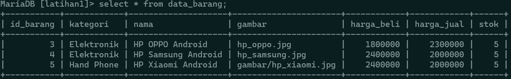
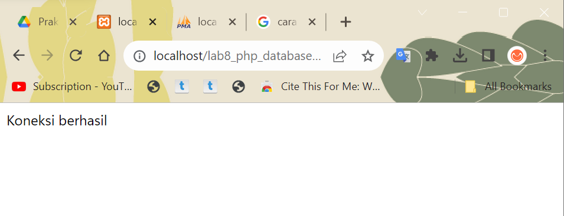
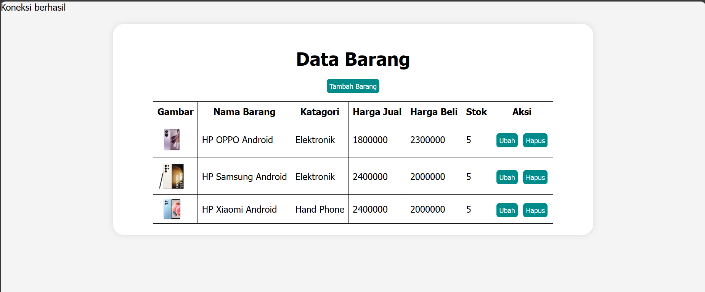
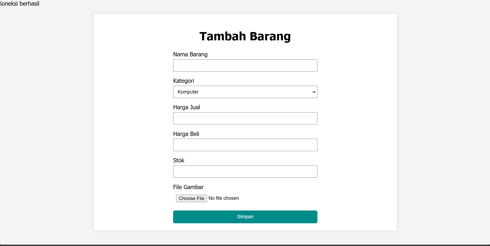
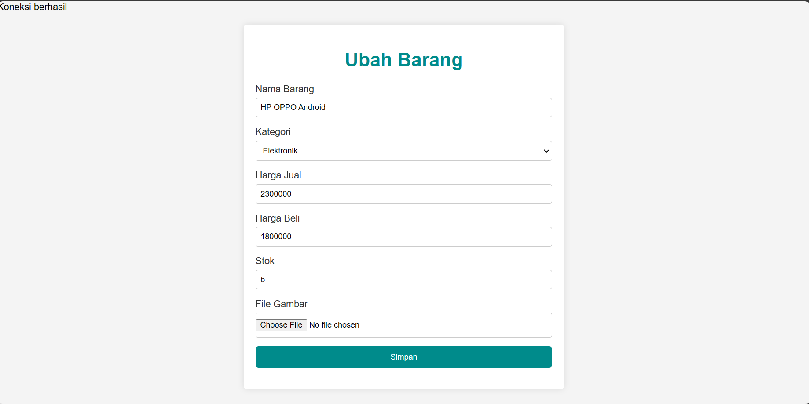
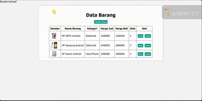

# **Lab 8 PHP Database**

```
Nama    : Dipca Anugrah
NIM     : 312210666
Kelas   : TI.22.A.4
Matkul  : Pemrograman Web 1
```

## **Daftar Isi**
**[Instruksi Praktikum](#instruksi-praktikum)**         
**[Langkah-langkah Praktikum](#langkah-langkah-praktikum)**         
**[Result](#result)**

## **Instruksi Praktikum**
1. Persiapkan text editor misalnya VSCode.
2. Buat folder baru dengan nama **lab8_php_database** pada docroot webserver 
(htdocs)
3. Ikuti langkah-langkah praktikum yang akan dijelaskan berikutnya.

## **Langkah-langkah Praktikum**
1. **Persiapan**
Untuk memulai membuat aplikasi CRUD sederhana, yang perlu disiapkan adalah 
database server menggunakan MySQL. Pastikan MySQL Server sudah dapat dijalankan 
melalui XAMPP. 

3. **Menjalankan MySQL Server**
Untuk menjalankan MySQL Server dari menu XAMPP Control.

4. **Membuat Database: Studi Kasus Data Barang**
    ```mysql
    CREATE DATABASE latihan1;
    ```

    ```mysql
    CREATE TABLE data_barang (
        id_barang int(10) auto_increment Primary Key,
        kategori varchar(30),
        nama varchar(30),
        gambar varchar(100),
        harga_beli decimal(10,0),
        harga_jual decimal(10,0),
        stok int(4)
    );
    ```
5. **Menambah Data**
    ```mysql
    INSERT INTO data_barang (kategori, nama, gambar, harga_beli, harga_jual, stok)
    VALUES ('Elektronik', 'HP Samsung Android', 'hp_samsung.jpg', 2000000, 2400000, 5),
    ('Elektronik', 'HP Xiaomi Android', 'hp_xiaomi.jpg', 1000000, 1400000, 5),
    ('Elektronik', 'HP OPPO Android', 'hp_oppo.jpg', 1800000, 2300000, 5);

    ```
    
6. **Membuat Program CRUD 7Buat folder lab8_php_database pada root directory web server (d:\xampp\htdocs)**

7. **Membuat file koneksi database**
    Buat file baru dengan nama **koneksi.php**
    ```php
    <?php
    $host = "localhost";
    $user = "root";
    $pass = "";
    $db = "latihan1";
    $conn = mysqli_connect($host, $user, $pass, $db);
    if ($conn == false)
    {
        echo "Koneksi ke server gagal.";
        die();
    } #else echo "Koneksi berhasil";
    ?>
    ```
    Buka melalui browser untuk menguji koneksi database untuk menyampilkan pesan 
    koneksi berhasil, uncomment pada perintah echo “koneksi berhasil”; 
    

8. **Membuat file index untuk menampilkan data (Read)**
    Buat file baru dengan nama **index.php**

    **Akses file -->**[index.php](index.php)

    

9. **Menambah Data (Create)**
    Buat file baru dengan nama **tambah.php**   

    **Akses file -->**[tambah.php](tambah.php)

    

10. **Mengubah Data (Update)**
    Buat file baru dengan nama **ubah.php**

    **Akses file -->**[ubah.php](ubah.php)

    

11. **Menghapus Data (Delete)**
    Buat file baru dengan nama **hapus.php**

    ```php
    <?php
    include_once 'koneksi.php';
    $id = $_GET['id'];
    $sql = "DELETE FROM data_barang WHERE id_barang = '{$id}'";
    $result = mysqli_query($conn, $sql);
    header('location: index.php');
    >

    ```

    **Akses file-->**[hapus.php](hapus.php)


## **Result**



<hr>

**[Back-->](#lab-8-php-database)**

    